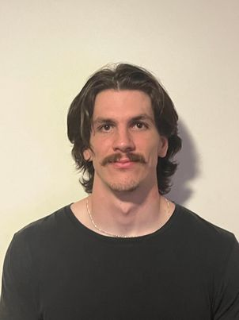

# About

My name is Jude O'Shea and I am currently a 5th year electrical enggineering student at the University of Queensland. I am currently partaking in the magnificent course ELEC4630, where I am currently learning about fastai. This blog will document my learnings of fastai, in partcular, the building of a image classifier. 

I am also currently in an internship position at a company called Shellby Power. Here I am helping in the deigning, manufacturing and upkeeping of large scale generators. I am learning many different ascepts life as an enggineer such as client interaction, product demonstration and useful softwares (autocad, word, etc). 

